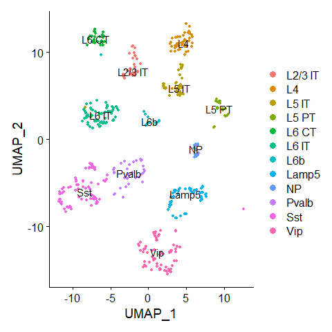
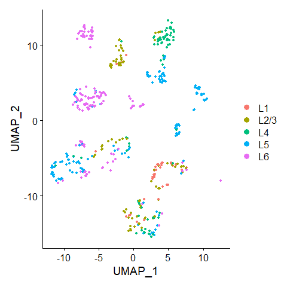

Generating Visium-like spot data
================
Robin Browaeys
2020-10-08

<!-- github markdown built using 
rmarkdown::render("vignettes/generate_syn_data.Rmd", output_format = "github_document")
-->

In this vignette, you can learn how to use synthvisium to generate
synthetic Visium-like spot data. First we will demonstrate it by using a
toy scRNAseq dataset as input (internal Seurat object of downsampled
brain cortex data). Later on, we will demonstrate it on a real scRNAseq
dataset (brain cortex) that can be downloaded from Zenodo. Using this
dataset as input for your own benchmark is recommended.

``` r
library(Seurat)
library(synthvisium)
library(dplyr)
```

# Generating synthetic Visium-like spot data from input scRNAseq data

## Generating Visium-like spot data from toy input scRNAseq data.

#### Explore input scRNAseq data

First we will explore the toy scRNAseq dataset (`seurat_obj`) and show
where the cell type information is stored in this object (`subclass`
column of the meta data)

``` r
# scrnaseq data
DimPlot(seurat_obj, group.by = "subclass", label = T)
```

<!-- -->

#### Generate the synthetic data

We provide one function to generate a dataset and its meta data. As
example here, we will generate a dataset consisting of 5 different
regions with each between 5 or 20 spots (and on average 30000 counts in
total per spot). The dataset type that will be created here is called
`artificial_diverse_distinct`, and is one of the 13 different
implemented options. As can be read in the documentation of the function
(`?generate_synthetic_visium`), here each artifical prior region has a
distinct set of cell types, and cell type frequencies are randomly
different for each cell type in each region.

``` r
synthetic_visium_data = generate_synthetic_visium(seurat_obj = seurat_obj, dataset_type = "artificial_diverse_distinct", clust_var = "subclass", n_regions = 5, n_spots_min = 5, n_spots_max = 20, visium_mean = 30000, visium_sd = 8000)
```

#### Explore the synthetic data object

Now we will go over the different components of this object:

First, we have the gene expression counts for each spot in the `counts`
sublist (genes in rows, spots in columns):

``` r
synthetic_visium_data$counts %>% as.matrix() %>% .[1:5,1:5]
##      priorregion1_spot_1 priorregion1_spot_2 priorregion1_spot_3 priorregion1_spot_4 priorregion1_spot_5
## Vip                 5287               11155                6689                4996                4294
## Sst                    0                   0                   0                   6                   0
## Npy                    2                   0                   0                   0                   1
## Tac2                   0                1822                 815                   0                 154
## Crh                   11                 920                1300                  83                 163
```

Then, you can also see the cell type composition (absolute numbers of
cells and relative proportions) of each generated spot in the
`spot_composition` `relative_spot_composition` sublists (names and prior
regions of the spot in the `name` and `region` columns):

``` r
synthetic_visium_data$spot_composition %>% .[1:10,]
##    L2.3.IT L4 L5.IT L5.PT L6.CT L6.IT L6b Lamp5 NP Pvalb Sst Vip                name       region
## 1        0  0     0     0     0     0   0     0  7     0   0   1 priorregion1_spot_1 priorregion1
## 2        0  0     0     0     0     0   0     0  1     0   0   1 priorregion1_spot_2 priorregion1
## 3        0  0     0     0     0     0   0     0  7     0   0   1 priorregion1_spot_3 priorregion1
## 4        0  0     0     0     0     0   0     0  3     0   0   1 priorregion1_spot_4 priorregion1
## 5        0  0     0     0     0     0   0     0  6     0   0   3 priorregion1_spot_5 priorregion1
## 6        0  0     0     0     0     0   0     0  2     0   0   0 priorregion1_spot_6 priorregion1
## 7        0  0     0     0     0     9   0     0  0     0   0   0 priorregion2_spot_1 priorregion2
## 8        0  0     0     0     0     8   0     0  0     0   0   0 priorregion2_spot_2 priorregion2
## 9        0  0     0     0     0     8   0     0  0     0   0   0 priorregion2_spot_3 priorregion2
## 10       0  0     0     0     0     8   0     0  0     0   0   0 priorregion2_spot_4 priorregion2
synthetic_visium_data$relative_spot_composition %>% .[1:10,]
##    L2.3.IT L4 L5.IT L5.PT L6.CT L6.IT L6b Lamp5        NP Pvalb Sst       Vip                name       region
## 1        0  0     0     0     0     0   0     0 0.8750000     0   0 0.1250000 priorregion1_spot_1 priorregion1
## 2        0  0     0     0     0     0   0     0 0.5000000     0   0 0.5000000 priorregion1_spot_2 priorregion1
## 3        0  0     0     0     0     0   0     0 0.8750000     0   0 0.1250000 priorregion1_spot_3 priorregion1
## 4        0  0     0     0     0     0   0     0 0.7500000     0   0 0.2500000 priorregion1_spot_4 priorregion1
## 5        0  0     0     0     0     0   0     0 0.6666667     0   0 0.3333333 priorregion1_spot_5 priorregion1
## 6        0  0     0     0     0     0   0     0 1.0000000     0   0 0.0000000 priorregion1_spot_6 priorregion1
## 7        0  0     0     0     0     1   0     0 0.0000000     0   0 0.0000000 priorregion2_spot_1 priorregion2
## 8        0  0     0     0     0     1   0     0 0.0000000     0   0 0.0000000 priorregion2_spot_2 priorregion2
## 9        0  0     0     0     0     1   0     0 0.0000000     0   0 0.0000000 priorregion2_spot_3 priorregion2
## 10       0  0     0     0     0     1   0     0 0.0000000     0   0 0.0000000 priorregion2_spot_4 priorregion2
```

If you want to see which cell type is present in which region, and with
which prior frequency, you can look at the `gold_standard_priorregion`
sublist.

``` r
synthetic_visium_data$gold_standard_priorregion %>% head()
## # A tibble: 6 x 4
##   prior_region celltype  freq present
##   <chr>        <chr>    <dbl> <lgl>  
## 1 priorregion1 Vip      0.143 TRUE   
## 2 priorregion1 NP       0.857 TRUE   
## 3 priorregion1 Sst      0     FALSE  
## 4 priorregion1 L4       0     FALSE  
## 5 priorregion1 L5 IT    0     FALSE  
## 6 priorregion1 L6 IT    0     FALSE
```

We also provide a data frame with properties of this specific dataset.
This might be useful in a benchmark to check the influence of these
properties on performance.

``` r
synthetic_visium_data$dataset_properties 
## # A tibble: 1 x 10
##   dataset_id                   dataset_type                real_artificial uniform_diverse distinct_overlap dominant_celltype missing_celltype rare_celltype missing_celltype_sc real_region_var
##   <chr>                        <chr>                       <chr>           <chr>           <chr>            <lgl>             <lgl>            <lgl>         <lgl>               <lgl>          
## 1 artificial_diverse_distinct1 artificial_diverse_distinct artificial      diverse         distinct         FALSE             FALSE            FALSE         NA                  NA
```

## Generating Visium-like spot data from toy input scRNAseq data, with inclusion of a ‘mock region’.

Because it could be possible that a cell type will belong to all
regions, we will make the synthetic data in such a way that we have a
‘mock region’ as well - no cell type should be predicted to belong to
this region. Adding a mock region is thus recommended when the synthetic
data will be used to evaluate spatial/region annotation of cells, not
when evaluating deconvolution tools. The mock region is generated
similar as the real regions, but the input cell type frequencies are the
same for each cell type, and after generation of the counts, the gene
names are shuffled such that cellular identities in this mock region are
lost.

``` r
synthetic_visium_data = generate_synthetic_visium(seurat_obj = seurat_obj, dataset_type = "artificial_diverse_distinct", clust_var = "subclass", n_regions = 5, n_spots_min = 5, n_spots_max = 20, visium_mean = 30000, visium_sd = 8000, add_mock_region = TRUE)
```

## Generating Visium-like spot data from toy input scRNAseq data that contains information of the anatomical regions of cells.

Just pooling cells from different cell types as done in the previous
example could have the (theoretical) disadvantage that spatial
information inherently encoded in the scRNAseq data is lost. This is
because cells extracted from a similar anatomical region could be
influenced by the same microenvironmental signal, resulting in a shared
spatial gene expression pattern for cells in the same region, which
could be reflected in the input scRNAseq data. In case you know the
anatomical origin from cells in the input scRNAseq data, it could be
useful to generate synthetic Visium-spot data by only sampling cells in
one spot if those cells belong to the same anatomical region.

In the brain cortex dataset, we have this information stored in the meta
data (`brain_subregion` column)

``` r
# scrnaseq data
DimPlot(seurat_obj, group.by = "brain_subregion")
```

<!-- -->

As the second example, we will now generate a dataset consisting of
artificial “L1 - L2/3 - L4 - L5 - L6” regions with each between 5 or 20
spots (and on average 30000 counts in total per spot). The dataset type
that will be created here is called `real`, and is one of the 13
different implemented options. As can be read in the documentation of
the function (`?generate_synthetic_visium`), this dataset type will
exploit the anatomical information and cell type frequencies per region
will be based on the number of cells in the corresponding region in the
input scRNAseq data.

``` r
synthetic_visium_data = generate_synthetic_visium(seurat_obj = seurat_obj, dataset_type = "real", clust_var = "subclass", region_var = "brain_subregion" , n_regions = NULL,
                                                    n_spots_min = 5, n_spots_max = 20, visium_mean = 20000, visium_sd = 5000)
```

## Generating Visium-like spot data from real input scRNAseq data.

The real input scRNAseq (Allen Brain Atlas brain cortex) can be
downloaded from Zenodo (<https://zenodo.org/record/4072975>).

``` r
# seurat_obj = readRDS(url("https://zenodo.org/record/4072975/files/seurat_obj_scrnaseq_cortex_filtered.rds")) # direct read from URL - will take a long time
# seurat_obj = readRDS(path/seurat_obj_scrnaseq_cortex_filtered.rds")) # after downloading and saving locally
```

Now, we will create a synthetic dataset based on this real dataset and
with a more realistic number of spots. This will take some time to run.
As another example dataset type, we pick here `real_top2_overlap`.

``` r
synthetic_visium_data = generate_synthetic_visium(seurat_obj = seurat_obj, dataset_type = "real_top2_overlap", clust_var = "subclass", region_var = "brain_subregion" , n_regions = NULL,
                                                    n_spots_min = 50, n_spots_max = 200, visium_mean = 20000, visium_sd = 5000)
```

# Using synthetic Visium-like spot data to evaluate performance of Visium-scRNAseq integration workflows

Check the following vignette to find a short demonstration of a basic
analysis you can do on this synthetic Visium data. We also show how to
do spatial annotation of cells through Seurat label transfer and compare
gold standard labels with predicted labels. [Analyzing synthetic
Visium-like spot data for evaluating label transfer
methods](analyze_syn_data.md):`vignette("analyze_syn_data",
package="synthvisium")`.

# Information about the different dataset types.

Currently, there are 17 possible dataset types implemented:

``` r
possible_dataset_types = c("real", "real_top1","real_top1_uniform","real_top2_overlap","real_top2_overlap_uniform", "real_missing_celltypes_visium", "artificial_uniform_distinct", "artificial_diverse_distinct",  "artificial_uniform_overlap", "artificial_diverse_overlap", "artificial_dominant_celltype_diverse", "artificial_partially_dominant_celltype_diverse", "artificial_missing_celltypes_visium",                      "artificial_dominant_rare_celltype_diverse","artificial_regional_rare_celltype_diverse", "artificial_diverse_distinct_missing_celltype_sc","artificial_diverse_overlap_missing_celltype_sc")
```

The dataset types that are possible for every input scRNAseq dataset and
that we recommend to use are:

``` r
recommended_dataset_types = c("artificial_uniform_distinct", "artificial_diverse_distinct",  "artificial_uniform_overlap", "artificial_diverse_overlap", "artificial_dominant_celltype_diverse", "artificial_partially_dominant_celltype_diverse", "artificial_dominant_rare_celltype_diverse","artificial_regional_rare_celltype_diverse")
#recommended_dataset_types = c("artificial_uniform_distinct", "artificial_diverse_distinct",  "artificial_uniform_overlap", "artificial_diverse_overlap", "artificial_dominant_celltype_diverse", "artificial_partially_dominant_celltype_diverse", "artificial_dominant_rare_celltype_diverse","artificial_regional_rare_celltype_diverse", "artificial_diverse_distinct_missing_celltype_sc","artificial_diverse_overlap_missing_celltype_sc")
```

Explanation of each of the types:

  - **real**: for each region (defined in scRNAseq data - region\_var -
    and thus **real** ), cell type frequencies are based on the number
    of cells in the corresponding region in the input scRNAseq data
  - **real\_top1**: for each region (defined in scRNAseq data and thus
    **real** ), we will only consider cell types that are most
    frequently present in that 1 region ( **top 1** ). Cell type
    frequencies are based on the number of cells in the corresponding
    region in the input scRNAseq data
  - **real\_top1\_uniform**: for each region (defined in scRNAseq data -
    region\_var - and thus **real** ), we will only consider cell types
    that are most frequently present in that 1 region ( **top 1** ).
    Cell type frequencies are equal for each cell type assigned to a
    region ( **uniform** )
  - **real\_top2\_overlap**: for each region (defined in scRNAseq data -
    region\_var - and thus **real** ), we will only consider cell types
    that if this particular region is among the 2 regions in which they
    are most abundant ( **top 2** ). As a consequence, there will be
    some **overlap** in cell type presence between two regions. Cell
    type frequencies are based on the number of cells in the
    corresponding region in the input scRNAseq data
  - **real\_top2\_overlap\_uniform**: for each region (defined in
    scRNAseq data - region\_var - and thus **real** ), we will only
    consider cell types that if this particular region is among the 2
    regions in which they are most abundant ( **top 2** ). As a
    consequence, there will be some **overlap** in cell type presence
    between two regions. Cell type frequencies are equal for each cell
    type assigned to a region ( **uniform** )
  - **real\_missing\_celltypes\_visium**: the same as the **real**
    dataset type, but now some random input scRNAseq cell types will be
    left out, and thus not used to generate synthetic data.
  - **artificial\_uniform\_distinct**: celltype-prior region assignments
    are entirely **artificial** and thus not based on possibly present
    regional information in the input scRNAseq data. Each artifical
    prior region has a distinct set of cell types here, and cell type
    frequencies are the same for each cell type in each region.
  - **artificial\_diverse\_distinct**: celltype-prior region assignments
    are entirely **artificial** and thus not based on possibly present
    regional information in the input scRNAseq data. Each artifical
    prior region has a distinct set of cell types here, and cell type
    frequencies are different for each cell type in each region.  
  - **artificial\_uniform\_overlap**: celltype-prior region assignments
    are entirely **artificial** and thus not based on possibly present
    regional information in the input scRNAseq data. Each artifical
    prior region could have some overlap in cell type contribution with
    other regions, and cell type frequencies are the same for each cell
    type in each region.  
  - **artificial\_diverse\_overlap**: celltype-prior region assignments
    are entirely **artificial** and thus not based on possibly present
    regional information in the input scRNAseq data. Each artifical
    prior region could have some overlap in cell type contribution with
    other regions, and cell type frequencies are different for each cell
    type in each region.  
  - **artificial\_dominant\_celltype\_diverse**: celltype-prior region
    assignments are entirely **artificial** and thus not based on
    possibly present regional information in the input scRNAseq data.
    Each artifical prior region could have some overlap in cell type
    contribution with other regions, and cell type frequencies are
    different for each cell type in each region. There is one dominant
    celltype that is present in each region, and is much more abundant
    than other cell types (5-15x more).
  - **artificial\_partially\_dominant\_celltype\_diverse**:
    celltype-prior region assignments are entirely **artificial** and
    thus not based on possibly present regional information in the input
    scRNAseq data. Each artifical prior region could have some overlap
    in cell type contribution with other regions, and cell type
    frequencies are different for each cell type in each region. There
    is one dominant celltype that is present in all but one regions
    (partially dominant), and is much more abundant than other cell
    types, except for one region where it is equally abundant.
  - **artificial\_missing\_celltypes\_visium**: the same as the
    ‘artificial\_diverse\_overlap’ dataset type, but now some random
    input scRNAseq cell types will be left out, and thus not used to
    generate synthetic data.
  - **artificial\_dominant\_rare\_celltype\_diverse**: the same as
    ‘artificial\_dominant\_celltype\_diverse’, except that the
    dominant cell type that is present in all regions is much less
    abundant than other cell types.
  - **artificial\_regional\_rare\_celltype\_diverse**: the same as
    ‘artificial\_dominant\_rare\_celltype\_diverse’, except that the
    rare cell type is now only present in one region instead of all
    regions.
  - **artificial\_diverse\_distinct\_missing\_celltype\_sc**: the same
    as ‘artificial\_diverse\_distinct’ except that we here include
    information in the `properties_df` about a random cell type that
    could be removed from the reference scRNAseq dataset later on during
    integration and evaluation. This to simulate a case where
    integration is done with an incomplete reference. Note that you
    should adapt your integration/evaluation code such that this
    missing\_celltype can be read by your integration/evaluation
    function, otherwise this will be the same as
    ‘artificial\_diverse\_distinct’
  - **artificial\_diverse\_overlap\_missing\_celltype\_sc**: the same as
    ‘artificial\_diverse\_distinct\_missing\_celltype\_sc’ but now based
    on the ‘artificial\_diverse\_overlap’ basic type.

Some important notes on these data types:

The data types indicated with the ‘real\_’ prefix are only possible to
use for input scRNAseq datasets that have a regional indication of each
cell. They could be extra difficult if these regional indicators are not
very distinct (and/or accurate). They also use the real cell type
frequency (= the number of cells of cell type of interest compared to
all cells in scRNAseq data)

The data types `real_missing_celltypes_visium` and
`artificial_missing_celltypes_visium` could be considered less realistic
since they assume that your visium data will lack cell types that are
present in your reference of the scRNAseq data. If the visium sample and
scRNAseq sample are taken from the same tissue, this won’t occur in
practice.

The data types `artificial_diverse_overlap_missing_celltype_sc` and
`artificial_diverse_distinct_missing_celltype_sc` can be used to
simulate the use case with an incomplete reference scRNAseq dataset, but
only if the integration and evaluation functions are adapted such that
they can exploit the additional information offered in the
`properties_df` output for these types. Note that you can simulate the
use case with an incomplete reference scRNAseq dataset as well in other
ways.
